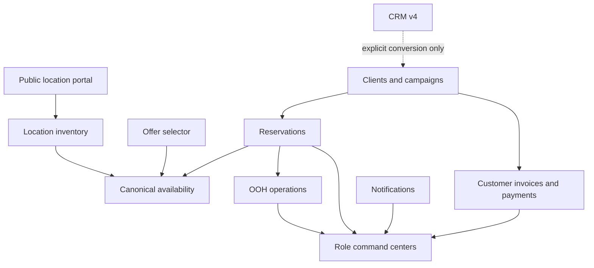

# Focus Media OOH Product Bible

This document is the canonical product reference. Detailed implementation and release evidence live in the linked domain documents; this file defines ownership, sources of truth, state rules, and boundaries that future changes must preserve.

## Product architecture

## Canonical domain ownership

| Domain | Source of truth | Compatibility boundary |
| --- | --- | --- |
| Public inventory | `Location` public DTO adapter | Never expose real coordinates, costs, internal notes, proofs, users, or full reservations |
| Commercial availability | lifecycle + active overrides + effective blocking reservations | legacy location state/date/scalar block fields are read-only fallback |
| Reservations | canonical reservation service with transactional lock/recheck | selector is read-only; legacy sync API returns 410 and historical import/reset writers are blocked |
| Clients/campaigns | `ClientAccount` and `Campaign` services | CRM company is not a client account |
| CRM | CRM v4 company/prospect/opportunity/event | legacy CRM models are historical read-only |
| Finance | `FinancialReceivable` plus individual active payments | SmartBill and spreadsheets are upstream import sources, not competing ledgers |
| Operations | BOOKED-derived work plus controlled OperationTask assignment pilot | no HOLD/RESERVED operational work; dual-read remains until cutover |
| Audit | append-only `AuditLog` and domain events | business writes must not silently skip audit failures |

## Availability rules

- Location lifecycle is `ACTIVE`, `INACTIVE`, `ARCHIVED`, or `MAINTENANCE`.
- Only active locations are commercially bookable.
- Active `LocationAvailabilityOverride` records can block an interval.
- `HOLD`, `RESERVED`, and `BOOKED` reservations block only under effective lifecycle rules.
- Expired HOLD/RESERVED records do not block even before status normalization.
- Intervals use inclusive start and inclusive end; sharing one day means overlap.
- Writes recheck availability inside the protected transaction.
- Legacy scalar block fields are compatibility reads only and must not receive new block values.

See [canonical-availability.md](./canonical-availability.md).

## Campaign state machine

Valid states are `draft`, `planned`, `active`, `completed`, `cancelled`, and `archived`.

- New campaigns cannot start as completed or archived.
- Invalid transitions are rejected server-side.
- Archiving uses a dedicated command and is blocked while effective reservations exist.
- Archived campaigns are terminal.
- Client and sales ownership are explicit; no silent owner fallback is allowed.

Transition details are maintained in [domain-state-cleanup-runbook.md](./domain-state-cleanup-runbook.md).

## Financial state and ledger rules

- RON and EUR are never summed together.
- An invoice balance is invoice value minus the sum of active payment records.
- A payment is append-only; correction cancels the original and creates a replacement.
- Overpayment requires explicit confirmation and creates client credit.
- Manual ledger entries take priority over later report snapshots.
- Imports stage and preview before canonical confirmation.
- Import rows and uploads have explicit transition guards.
- Completed invoices remain available in history but are not part of open-balance operational KPIs.
- SmartBill remains a restricted integration source; normal work happens in Facturi clienti.

## CRM boundary

- CRM v4 tracks companies, prospects, opportunities, next actions, and append-only events.
- CRM records do not automatically create `ClientAccount`, campaigns, reservations, invoices, or payments.
- Conversion after a won opportunity is explicit, permissioned, and audited.
- Sales edits own scope; COO is read-only; global managers follow RBAC policy.
- Forecast is deterministic by stage; no manual weighted value is used.

See [CRM_V4_CONVERGENCE.md](./CRM_V4_CONVERGENCE.md).

## Operational boundary

- HOLD and RESERVED never create decoration or neutralization work.
- BOOKED creates operational work according to installation/neutralization dates.
- Field operators see only explicit assignments when the assignment pilot is enabled.
- Completion by field requires proof according to policy.
- Proof photographs are private and temporary; they are not location gallery images.
- Rescheduling requires reason and audit and never updates SmartBill automatically.
- OperationTask remains in pilot/dual-read compatibility until approved cutover.

See [OPERATIONAL_ASSIGNMENT_PILOT.md](./OPERATIONAL_ASSIGNMENT_PILOT.md).

## Release and migration governance

- Use isolated preview data for write tests.
- Never run production backfill without reviewed dry-run output.
- Use expand-migrate-contract for state/schema cleanup.
- Do not deploy destructive contract changes with the backfill that prepares them.
- Compare sensitive counts before and after release.
- Production smoke is read-only unless a separately approved pilot says otherwise.
- Every release records previous deployment and exact rollback command.

See [release-governance.md](./release-governance.md) and [domain-state-cleanup-runbook.md](./domain-state-cleanup-runbook.md).

## Current cleanup status

Milestone 15 establishes application state machines and canonical writers without destructive schema changes. Historical CRM data, ImportBatch, OperationTask compatibility, and legacy location columns remain preserved. Their removal is a future contract phase, not part of the current release.
