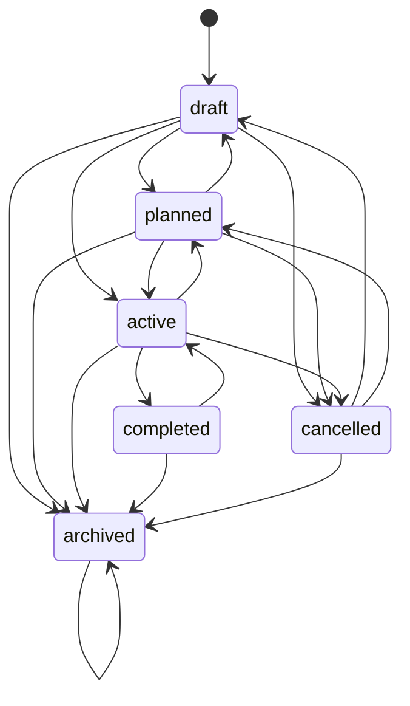
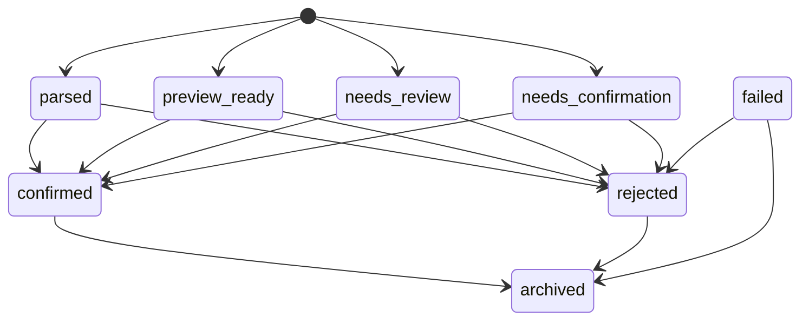
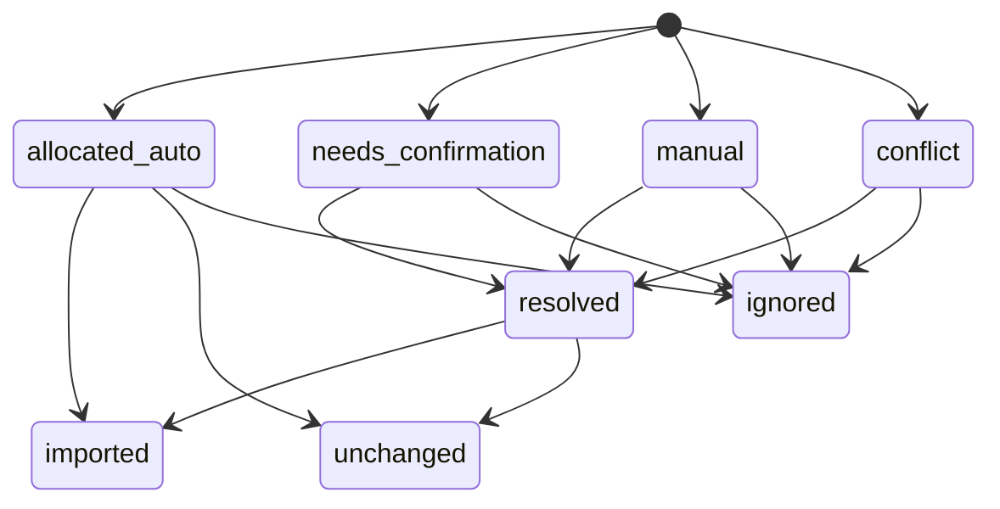
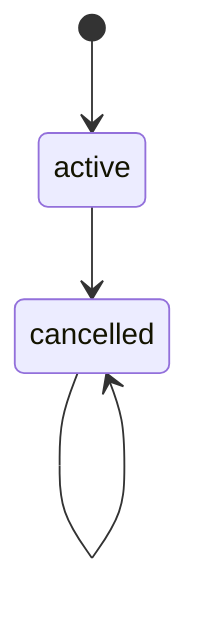

# Domain State Cleanup Runbook

## Scope and release classification

- Branch: `stabilization-15-domain-state-cleanup`
- Base commit: `6ae13f0c0eee73a0d3a6c54f0816994d145437d3`
- Release type: backward-compatible `expand`
- Database migration in this release: none
- Production backfill in this release: none
- Destructive contract step in this release: forbidden

The current repository is newer than the original audit baseline. This runbook records the real dependencies found at the base commit and is the gate for later schema cleanup.

## Dependency proof

| Domain | Canonical implementation | Compatibility found | Current decision |
| --- | --- | --- | --- |
| Campaign | `src/lib/campaigns.ts` | `Campaign.status` is a free string | Add application state machine now; keep DB column for mixed-version compatibility |
| Receivables | ledger payments + `receivables-domain.ts` | status snapshots remain strings | Keep derived status; validate upload/import/payment transitions |
| Inventory import | secure spreadsheet parser + `ImportBatch` | `ImportBatch` looked unused in old audit | Retain; it is the active inventory import audit record |
| Location availability | lifecycle + `LocationAvailabilityOverride` + reservations | legacy status/date/block scalars are read fallback | Stop new legacy writes; retain reads; clear scalars only on explicit unblock |
| Reservation sync | canonical reservation service | `/api/admin/reservations/sync` and historical import service | API retired with 410; package import command removed; direct legacy import write is blocked; source retained only as migration evidence |
| CRM | CRM v4 | legacy models contain historical rows | Legacy routes remain 410; models stay read-only |
| OperationTask | assignment pilot + derived BOOKED metadata | dual-read/bridge flags and 288 derived rows | Keep compatibility; no schema contract until pilot cutover |
| Dashboard | role dashboard services | old `dashboard.ts` and finance panel have no runtime imports | Keep until SmartBill integration UI/tests are moved and log retention proves zero use |

Runtime log search for the previous 24 hours found no calls for reservation sync, legacy CRM, legacy finance stage, or the old financial summary route. Vercel retention did not provide a reliable seven-day proof, so code deletion is intentionally deferred.

The destructive legacy archive/reset command was removed from `package.json`; invoking the historical script with `--apply` now fails closed. Its read-only backup/audit path remains available for evidence.

## State diagrams

### Campaign



Archiving is allowed only through the dedicated command because it verifies active reservations. A generic campaign update cannot set `archived`.

### Financial report import



### Receivables import row



`imported`, `unchanged`, and `ignored` are terminal. Receivable business status remains derived from invoice amount, active payment ledger, and due date.

### Payment



A correction cancels the original payment and creates a new active payment linked through `correctsPaymentId`. It never rewrites payment history.

## Location compatibility policy

1. New and edited locations write lifecycle and descriptive inventory fields.
2. Commercial availability is calculated from canonical reservations and active overrides.
3. The editor cannot write legacy `status`, `availableFrom`, `availableUntil`, `bookedFrom`, or `bookedUntil`.
4. Spreadsheet and JSON imports cannot update those legacy state fields.
5. New manual blocks write only `LocationAvailabilityOverride`.
6. Explicit unblock clears canonical overrides and old scalar block values in the same transaction so the read fallback cannot re-block the location.
7. Legacy scalar reads remain until the dry-run is reviewed and all consumers are removed.

## Dry-run

Run:

```bash
pnpm run audit:domain-state-cleanup
```

The command is read-only and returns:

- all current state counts;
- unknown values;
- legacy scalar block classifications;
- ImportBatch usage;
- legacy reservation mirror count;
- CRM legacy/v4 counts;
- OperationTask assigned/unassigned counts;
- a checksum for repeatability.

Legacy blocks are classified as:

- `ALREADY_CANONICAL`: an active commercial override already exists;
- `SAFE_AUTOFILL`: reason and start date exist, but no override exists;
- `NEEDS_REVIEW`: only partial evidence exists;
- `UNRESOLVED`: no defensible business meaning can be inferred.

This script intentionally has no apply switch.

## Expand-migrate-contract plan

### Phase 1: expand (this release)

- explicit application state machines;
- server-side transition rejection;
- canonical location writers;
- reservation sync API retired;
- read-only audit and checksums;
- no DDL and no data backfill.

### Phase 2: migrate (separate approval)

- run dry-run on an isolated clone;
- review all unknown states and legacy blocks;
- create missing overrides only for approved `SAFE_AUTOFILL` rows;
- attach batch ID, actor, reason, before/after, and checksum;
- verify availability decisions before/after for every affected location;
- validate OperationTask pilot assignment and dual-read parity;
- observe zero legacy route usage for a retention window.

### Phase 3: contract (separate release)

- remove legacy status controls and adapters with proven zero consumers;
- remove scalar block columns only after backup and checksum verification;
- remove CRM historical models only under a dedicated retention decision;
- remove OperationTask bridge only after assignment cutover;
- remove unused dashboard services after SmartBill integration UI is relocated;
- remove `ImportBatch` only if inventory import receives another durable audit record.

The destructive contract step must not share a deployment with the backfill.

## Clone timing and lock analysis

This release has no schema DDL and therefore adds no MySQL metadata locks. A future enum/check-constraint or column-drop migration must be tested against a production-sized clone and record:

- table row count and storage size;
- `ALTER TABLE` algorithm chosen by MySQL;
- metadata lock wait;
- execution time;
- application compatibility during mixed versions;
- checksum before/after;
- restore duration from backup.

Prefer application validation plus indexed string columns until the clone proves an online constraint rollout is safe. Column drops require a maintenance/online-DDL plan and a separate approval.

## Rollback

Because this phase has no database migration or backfill, rollback is application-only:

```bash
pnpm dlx vercel rollback <previous-production-deployment-id>
```

Reverting the release restores old writers. It does not require data compensation because no automated production mutation is performed by deployment or smoke.

## Gates

GO for this expand release requires all domain tests, RBAC, availability, finance, CRM, operational, public privacy, Prisma validation, build, preview smoke, and unchanged sensitive counts.

NO-GO for destructive contract remains until:

- OperationTask pilot has assigned tasks and proven parity;
- legacy block dry-run has no unresolved rows;
- zero legacy write traffic is observed for an adequate retention window;
- mixed-version clone test passes;
- a reviewed backup/restore plan exists.
